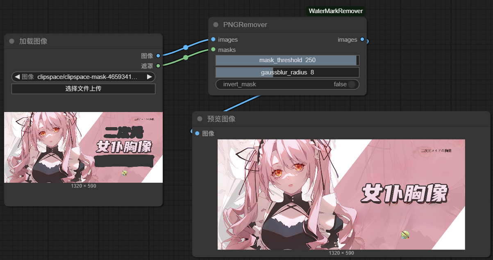
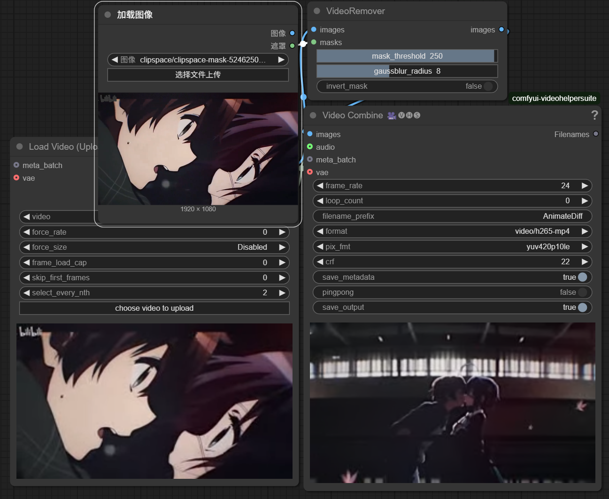

# Comfyui lama remover
A very simple ComfyUI node to remove item like image/video with mask watermark

## Install
- Navigate to `/ComfyUI/custom_nodes/` folder 
- Run \
`git clone https://github.com/benda1989/WaterMarkRemover_ComfyUI.git` 
- Restart ComfyUI 
- (If downlaod error occued) \
Download [big-lama.pt](https://github.com/Sanster/models/releases/download/add_big_lama/big-lama.pt) model to `/ComfyUI/custom_nodes/WaterMarkRemover_ComfyUI/` folder

## Examples

